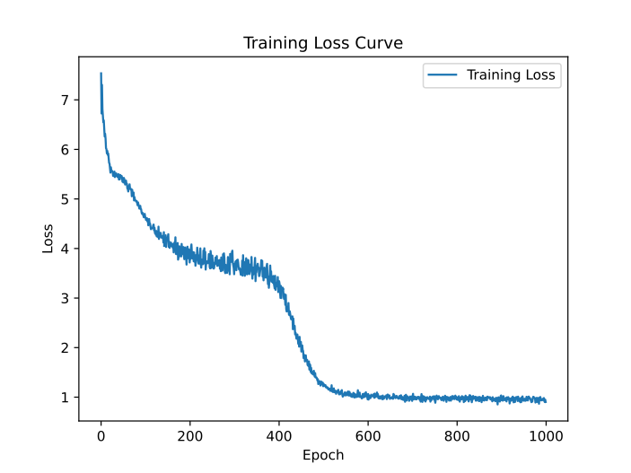

# 古诗生成 Transformer 模型

本项目基于 Transformer 架构实现了一个古诗生成模型。通过训练，模型能够根据用户输入的五言诗前句，自动生成完整的古诗。项目包括数据预处理、模型训练、损失曲线可视化以及测试生成功能。**训练过程使用了 8 张 H100 显卡，以加速模型收敛并提升训练效率。**

---

## 项目结构

```
project/
├── archive/                  # 原始数据文件夹
│   └── 5yan.txt              # 古诗数据集
├── ckpt/                     # 模型检查点文件夹
│   └── base_final.pt         # 训练好的模型
├── figures/                  # 可视化结果文件夹
│   ├── base_loss_curve.pdf   # 训练损失曲线
│   └── case.png              # 测试生成案例
├── dataset.py                # 数据加载与预处理
├── main.py                   # 模型训练主程序
├── model.py                  # Transformer 模型定义
├── requirements.txt          # 依赖库列表
├── run.sh                    # 训练脚本
└── test.py                   # 测试生成程序
```

---

## 功能特性

- **数据预处理**：支持从原始古诗数据集中加载数据，并进行分词、添加特殊标记（如 `<bos>` 和 `<eos>`）。
- **模型训练**：基于 PyTorch 实现 Transformer 模型（稀疏注意力、自定义残差连接位置、GLU 激活函数、相对位置编码等），支持多卡训练和模型检查点保存。
- **损失曲线可视化**：训练过程中自动保存损失曲线，便于分析模型收敛情况。
- **古诗生成**：提供交互式测试程序，用户输入五言诗前句，模型生成完整古诗。

---

## 快速开始

### 1. 环境配置

确保已安装 Python 3.9.2+ 和 PyTorch 2.1.0+，然后安装依赖库：

```bash
pip install -r requirements.txt
```

### 2. 数据准备

将古诗数据集放入 `archive/5yan.txt`，每行一首诗，例如：

```
床前明月光，疑是地上霜。举头望明月，低头思故乡。
春眠不觉晓，处处闻啼鸟。夜来风雨声，花落知多少。
```

### 3. 模型训练

运行以下命令开始训练：

```bash
bash run.sh
```

训练脚本 `run.sh` 的主要参数如下：

- `--train_data_path`：数据集路径（默认：`./archive/5yan.txt`）。
- `--batch_size`：批量大小（默认：512）。
- `--epochs`：训练轮数（默认：100）。
- `--lr`：学习率（默认：5e-4）。
- `--use_glu`：使用GLU（默认：`False`）。
- `--use_relative_pos`：使用相对位置编码（默认：`False`）。
- `--use_sparse_attn`：使用稀疏注意力（默认：`False`）。
- `--residual_before_ln`：残差前置（默认：`True`）。
- `--num_layers`：Transformer层数（默认：12）。
- `--use_custom`：完全自行搭建模型（默认：`False`）。

训练过程中，模型检查点会保存到 `ckpt/` 文件夹，损失曲线会保存到 `figures/`文件夹。

**注意**：训练使用了 8 张 H100 显卡，以加速模型收敛并提升训练效率。如果硬件条件不足，可以调整 `run.sh` 中的 `--world_size` 参数以适应本地环境。

### 4. 测试生成

运行以下命令启动交互式测试程序：

```bash
python test.py
```

输入五言诗的前句，例如：

```
欢迎使用古诗生成模型！输入前句以生成后续诗句，输入 'exit' 以退出。
=======================开始生成=======================

请输入五言诗的前句：床前明月光
```
提供ckpt的下载链接如下
```
https://disk.pku.edu.cn/link/AA4C3B7DF08E2F48B7ADEB6023D01641D6
文件名：base_final.pt
有效期限：2025-03-15 07:09
提取码：xn2A
```
---

## 代码说明

#### 1. `dataset.py`

- **`PoemDataset` 类**：负责加载古诗数据集，并进行分词、添加特殊标记。
- **词汇表**：自动构建词汇表（`word2idx` 和 `idx2word`）。

#### 2. `model.py`

- **`TransformerPoem` 类**：基于 PyTorch 实现 Transformer 模型，支持自定义残差连接位置、GLU 激活函数、相对位置编码等。
- **`TransformerPoemCustom` 类**：使用 PyTorch 基础模块逐步搭建 Transformer 模型。

#### 3. `main.py`

- **训练逻辑**：实现数据加载、模型训练、损失记录、模型保存等功能。
- **多卡训练**：支持使用 `torchrun` 进行分布式训练。

#### 4. `test.py`

- **交互式生成**：加载训练好的模型，允许用户输入五言诗前句，生成完整古诗。

---

## 实验结果

### 1. 损失曲线

训练过程中，损失曲线会保存到 `figures/`，示例如下：



### 2. 测试案例

测试生成的结果示例如下：

```
欢迎使用古诗生成模型！输入前句以生成后续诗句，输入 'exit' 以退出。
=======================开始生成=======================

请输入五言诗的前句：床前明月光
生成的诗歌： 床前明月光，空潢不敢顾。返景入古径，倚杖候荆扉。
请输入五言诗的前句：窗前明月光
生成的诗歌： 窗前明月光，菡萏发荷花。浮云良子意，禅饮一帆悬。日夕怀间暮，知音世所稀。漾漾泛菱荇，七香留忘言。
请输入五言诗的前句：一阵寒风起
生成的诗歌： 一阵寒风起，英泥小阙枝。欲将轻舟会，城中增暮雁。少壮能几时，把酒话桑麻。凄凉差连雪，浑欲又南回。
请输入五言诗的前句：北大和清华
生成的诗歌： 北大和清华，分幸服蛾眉。江流天地胆，大江弄青梅。
请输入五言诗的前句：间谍过家家
生成的诗歌： 间<unk>过家家，莓苔夜带刀。停船暂借问，人归在斋读。但去深不见，山中芜已苍。平生自兹去，沿洄安得住。
请输入五言诗的前句：exit
程序退出。
```

---

## 依赖库

- Python 3.9.2+
- PyTorch 2.1.0+
- matplotlib

完整依赖库见 `requirements.txt`。

---

## 未来工作

- 支持更多类型的古诗生成（如七言诗）。
- 优化模型架构，提升生成质量，目前使用[全量数据](https://www.kaggle.com/datasets/qianboao/chinesepoetrydataset)诗词混合一起训练，其实数据量大，反而难以成句效果很差
- 提供 Web 界面，方便用户交互。

---

## 致谢

- 感谢 [PyTorch](https://pytorch.org/) 提供的深度学习框架。
- 感谢 [Transformer 论文](https://arxiv.org/abs/1706.03762) 提供的架构。

---

如果有任何问题或建议，欢迎提交 Issue 或联系作者！
